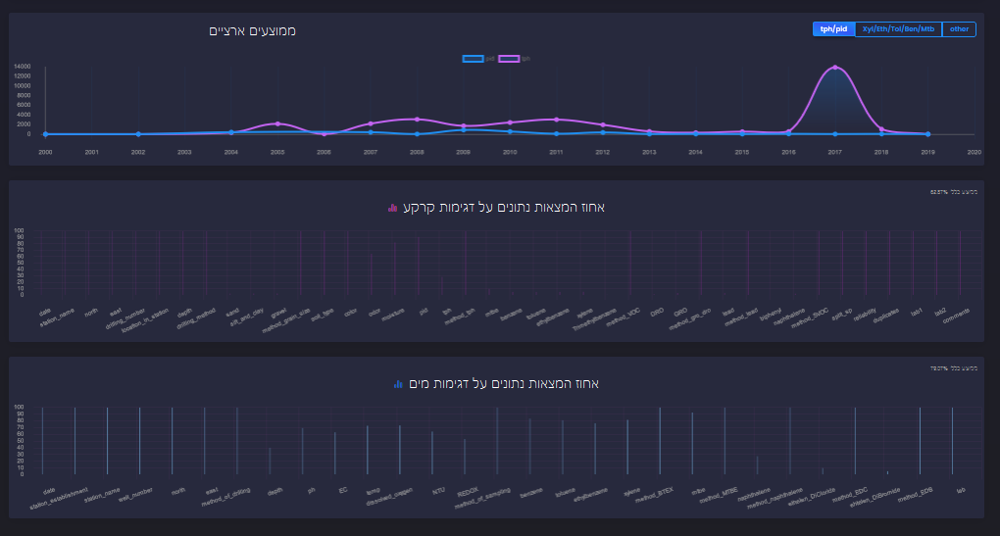
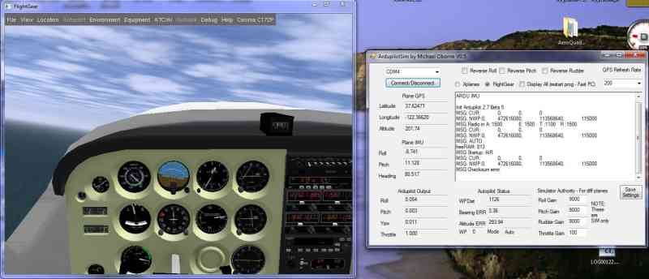
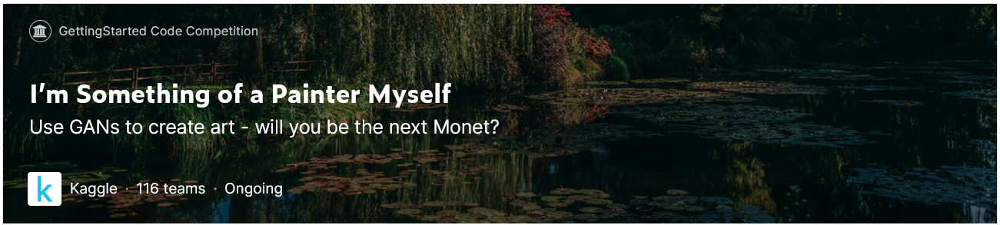
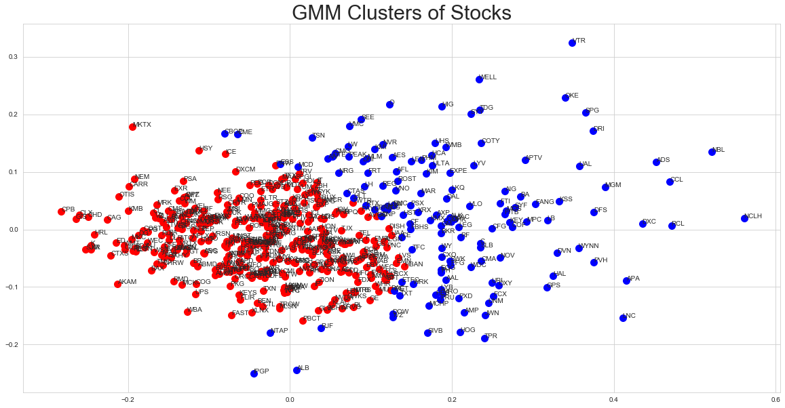
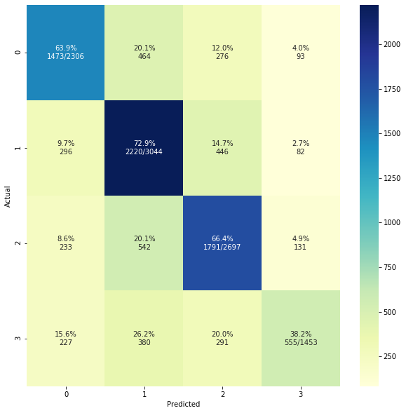
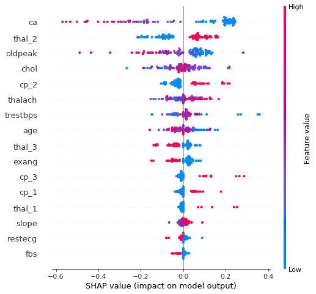

## [AquaS-The Platform For Groundwater Pollution Risk Analysis](https://github.com/SDIdo/AquaS)

### Project snippet:

Scrolling down we have broad statistics regarding combined effect of each sample in function of time. If interested in the status of the soil PID and TPH are the measurements for pollution.
If interested in the status of the groundwater then Xylene, MTBE, Toluene, Benzene and Ethylbenzene are the pollutants which we try to eliminate as much as we can from our groundwater. 

## [Flight Simulation Control in C++](https://github.com/SDIdo/FlightSimulation)

### Project snippet:

<a href="https://www.flightgear.org/">Flight Gear</a> is a free cross platform flight simulator written in C and C++.
Flight Gear allows telnet connection via termnial or shell thus
in this project we have established an autopilot feature for Flight Gear.
By writing a file with flight commands and conditions written in a script format 
our program can then take this file to translate and communicate it to Flight Gear.
This project was delegated to communication part and the language part.

## [CycleGANMonet](https://github.com/SDIdo/CycleGANMonet)
Computer Vision Project - Use GANs to create art.  Scored 55.30 on the Kaggle Challenge.

Please refer to the attached [Project Report](https://github.com/SDIdo/CycleGANMonet/blob/main/Project%20Report.pdf) for more inside elaboration on implementation.

## [Stocks Clustering](https://github.com/SDIdo/StocksClustering)

Find average daily return clusters of the sp500 stocks and analyzing the effect of Covid-19
on companies. Using various models and methods: Kmeans, Agglomerative Clustering and GMM.

Project snippet:

Clustering stocks with GMM - much better separation.
 
 
 
## [Hotel_Data_Insights](https://github.com/SDIdo/Hotel_Data_Insights)

In this project we use a dataset with over 150,000 entries based on real booking reservations made from various hotels in New York City. Througout the project we use various models and methods in order to predict discount codes.

project snippet:

Confusion matrix of our neural network
 
  
  
## [ML4HC_Fairness](https://github.com/SDIdo/ML4HC_Fairness)

Predicting heart disease with regards to Fairness.

Project snippet:

Tornado Graph from SHAP the 5 most impacting features
 
